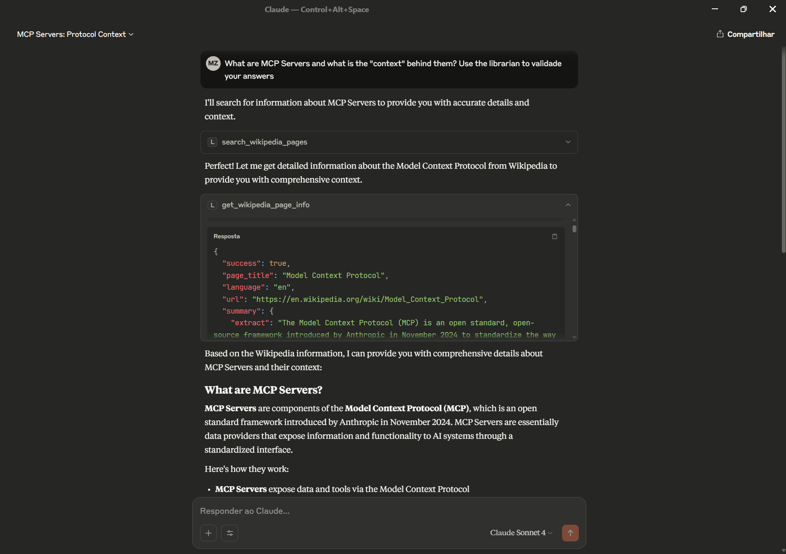
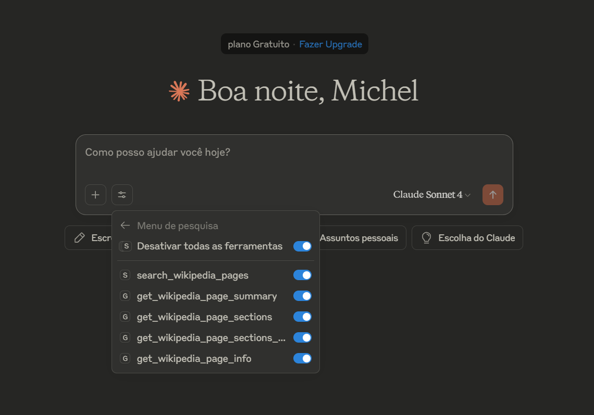
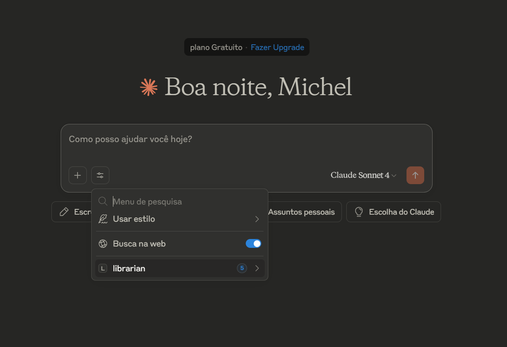
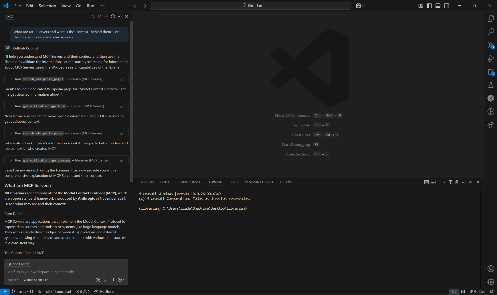

# librarian

Librarian is a MCP (Model Context Protocol) Server that allows any LLM with a compatible MCP client to query Wikipedia for information. It can be configured to automatically fact-check information without requiring explicit user requests.

> *"The only thing that you absolutely have to know is the location of the library."*
> 
> — Albert Einstein

<div align="center">



*Example of Claude Desktop using the librarian MCP server to fact-check information*

</div>

## Features

- **Automatic Fact-Checking**: Configure Claude Desktop to proactively verify factual claims using Wikipedia
- **Wikipedia Search**: Search for relevant Wikipedia articles
- **Page Information**: Get detailed information about specific Wikipedia pages
- **Page Summaries**: Quick summaries of Wikipedia pages
- **Page Sections**: Get specific sections from Wikipedia pages
- **Multi-language Support**: Query Wikipedia in different languages

## Installation for Claude Desktop

This MCP server is designed to work with Claude Desktop. Follow these steps to set it up:

### 1. Prerequisites

- [Claude Desktop](https://claude.ai/download) installed on your computer
- [uv](https://docs.astral.sh/uv/) package manager installed
- Python 3.13 or higher

### 2. Clone and Set Up the Project

```bash
git clone <your-repository-url>
cd librarian
uv sync
```

### 3. Configure Claude Desktop

Add this configuration to your Claude Desktop configuration file:

**Windows**: `%APPDATA%\Claude\claude_desktop_config.json`
**macOS**: `~/Library/Application Support/Claude/claude_desktop_config.json`
**Linux**: `~/.config/Claude/claude_desktop_config.json`

```json
{
    "mcpServers": {
        "librarian": {
            "command": "uv",
            "args": ["run", "python", "librarian.py"],
            "cwd": "C:\\Users\\YourUsername\\Documents\\librarian",
            "env": {
                "PYTHONPATH": "C:\\Users\\YourUsername\\Documents\\librarian"
            }
        }
    }
}
```

**Important**: Replace `C:\\Users\\YourUsername\\Documents\\librarian` with the actual path where you cloned the repository.

### 4. Restart Claude Desktop

After adding the configuration, restart Claude Desktop completely to load the MCP server.

## Automatic Fact-Checking Setup

To make Claude Desktop automatically use Wikipedia for fact-checking, start your conversations with:

```
"Use your Wikipedia tools to automatically fact-check any factual claims in our conversation. Don't wait for me to ask - proactively verify information and provide corrections when needed."
```

Or use the built-in system prompt by referencing: `fact_checking_instructions`

### Behavior Examples

Once configured, Claude Desktop will automatically:

- ✅ Verify historical dates and events
- ✅ Check biographical information  
- ✅ Confirm scientific facts and discoveries
- ✅ Validate geographical information
- ✅ Correct common misconceptions
- ✅ Provide source attribution from Wikipedia

## Available Tools

1. **search_wikipedia_pages**: Search for Wikipedia articles on any topic and return the top 5 results with selection information
2. **get_wikipedia_page_info**: Get comprehensive information about a specific page including content, summary, hyperlinked words, and categories
3. **get_wikipedia_page_summary**: Get quick summaries of Wikipedia pages with customizable sentence length
4. **get_wikipedia_page_sections**: Get a list of all sections on a Wikipedia page for large pages where you need specific information
5. **get_wikipedia_page_sections_info**: Get detailed content for specific sections of a Wikipedia page by title or index

All tools support multi-language Wikipedia queries by specifying the language parameter (default: "en").

## Examples

### Available Tools in Claude Desktop


*Screenshot showing the Wikipedia tools available in Claude Desktop when the MCP server is properly configured*

### MCP Servers Configuration


*Claude Desktop showing the librarian MCP server successfully connected and available*

### VS Code Integration Example


*Example of using the librarian tools within VS Code with GitHub Copilot*

## License

This project is open source. Please check the license file for details.