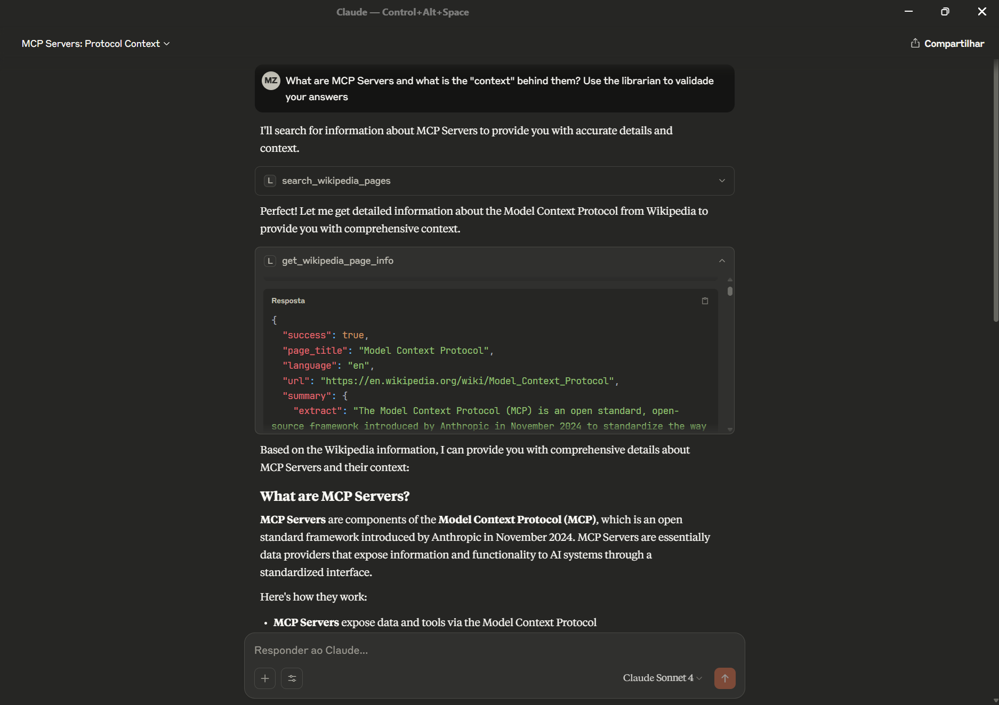
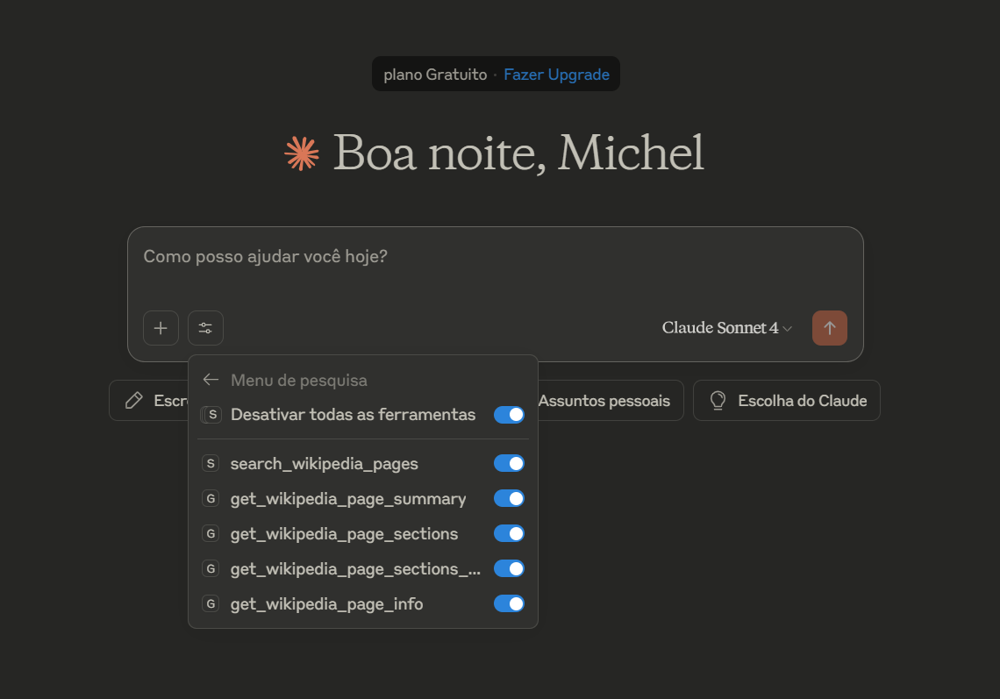
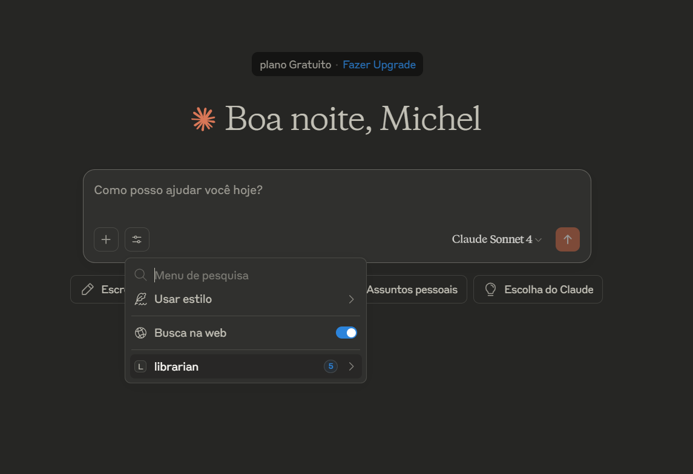
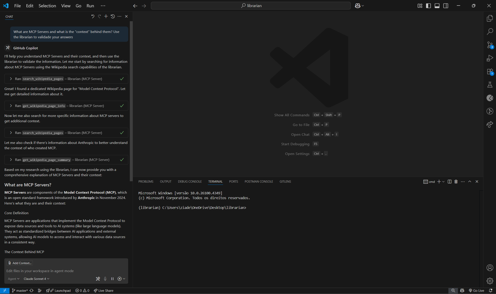

# librarian

Librarian is a MCP (Model Context Protocol) server that allows any LLM with a compatible MCP client to query Wikipedia for information. It can be configured to automatically fact-check information without requiring explicit user requests.

It communicates exclusively over **Streamable HTTP** (MCP spec 2026-07-28).

> *"The only thing that you absolutely have to know is the location of the library."*
>
> — Albert Einstein

<div align="center">



*Example of an LLM using the librarian MCP server to fact-check information*

</div>

## Features

- **Automatic Fact-Checking**: Configure your LLM client to proactively verify factual claims using Wikipedia
- **Wikipedia Search**: Search for relevant Wikipedia articles
- **Page Information**: Get detailed information about specific Wikipedia pages
- **Page Summaries**: Quick summaries of Wikipedia pages
- **Page Sections**: Get specific sections from Wikipedia pages
- **Multi-language Support**: Query Wikipedia in different languages

## Installation

### Prerequisites

- [uv](https://docs.astral.sh/uv/) package manager installed
- Python 3.13 or higher

### Setup

```bash
git clone <your-repository-url>
cd librarian
uv sync
```

### Running the server

```bash
uv run python librarian_server.py
```

The server starts on `http://0.0.0.0:8000`. The MCP endpoint is available at `/mcp`.

For production deployments behind gunicorn, use the ASGI adapter:

```bash
gunicorn librarian_wsgi:app -w 4 -k uvicorn.workers.UvicornWorker --bind 0.0.0.0:8000
```

## Client Configuration

Add this to your MCP client configuration to connect to the server:

```json
{
    "mcpServers": {
        "librarian": {
            "url": "https://your-server-host/mcp"
        }
    }
}
```

### Connect to Claude Code

First, start the server:

```bash
uv run python librarian_server.py
```

Then register it with Claude Code:

```bash
claude mcp add librarian -t http http://localhost:8000/mcp
```

The Wikipedia tools will be available automatically in your next Claude Code session.

## Automatic Fact-Checking Setup

To make your LLM client automatically use Wikipedia for fact-checking, start your conversations with:

```
"Use your Wikipedia tools to automatically fact-check any factual claims in our conversation. Don't wait for me to ask - proactively verify information and provide corrections when needed."
```

Or use the built-in prompt by referencing: `fact_checking_instructions`

### Behavior Examples

Once configured, your LLM client will automatically:

- Verify historical dates and events
- Check biographical information
- Confirm scientific facts and discoveries
- Validate geographical information
- Correct common misconceptions
- Provide source attribution from Wikipedia

## Available Tools

1. **search_wikipedia_pages**: Search for Wikipedia articles on any topic and return the top 5 results with selection information
2. **get_wikipedia_page_info**: Get comprehensive information about a specific page including content, summary, hyperlinked words, and categories
3. **get_wikipedia_page_summary**: Get quick summaries of Wikipedia pages with customizable sentence length
4. **get_wikipedia_page_sections**: Get a list of all sections on a Wikipedia page for large pages where you need specific information
5. **get_wikipedia_page_sections_info**: Get detailed content for specific sections of a Wikipedia page by title or index

All tools support multi-language Wikipedia queries by specifying the language parameter (default: `"en"`).

## Examples

### Available Tools


*Screenshot showing the Wikipedia tools available when the MCP server is properly configured*

### MCP Servers Configuration


*MCP client showing the librarian server successfully connected and available*

### VS Code Integration Example


*Example of using the librarian tools within VS Code with GitHub Copilot*

## Migration to MCP 2026-07-28

This project was originally built against the MCP `2025-11-05` spec (SDK v1.x). It has been fully migrated to the **MCP `2026-07-28` spec** (SDK v2.0.0).

### What changed in the spec

The 2026-07-28 release is the most significant MCP revision to date. Its core change is a shift from a **stateful, session-based** protocol to a **stateless, request/response** protocol:

- The `initialize`/`initialized` handshake is **removed** — clients send capabilities on every request via `_meta`
- The `Mcp-Session-Id` header is **removed** — servers are now load-balancer friendly out of the box
- The **WebSocket transport is removed** entirely
- The **HTTP+SSE transport is deprecated** in favour of Streamable HTTP
- A new `server/discover` endpoint is required (handled automatically by the SDK)
- Tool/resource/prompt results are now **validated against the protocol schema at decoration time**

### What was updated in this repo

| File | Change |
|---|---|
| `pyproject.toml` | `mcp>=2.0.0`, `httpx` → `httpx2`, removed `websockets`, added `anyio`, `opentelemetry-api` |
| `librarian.py` | `FastMCP` → `MCPServer` (new import path and constructor) |
| `wiki/api.py` | `import httpx` → `import httpx2` (same API surface, renamed package) |
| `librarian_server.py` | Replaced custom WebSocket + SSE implementation with `mcp.streamable_http_app(stateless_http=True)` |
| `librarian_wsgi.py` | Same replacement as above |
| `librarian_stdio.py` | **Deleted** — server is now HTTP-only |
| `resources/prompt_resources.py` | Fixed prompt return types: `dict` with invalid `role:"system"` → plain `str` |
| `tools/wikipedia_tools.py` | Removed unused `Tool` import and dead `WIKIPEDIA_TOOLS` list |

### Updated connection endpoints

The previous WebSocket (`wss://`) and SSE (`/sse`) endpoints are no longer available. All clients connect via the Streamable HTTP endpoint:

```json
{
    "mcpServers": {
        "librarian": {
            "url": "https://your-server-host/mcp"
        }
    }
}
```

---

## License

This project is open source. Please check the license file for details.
